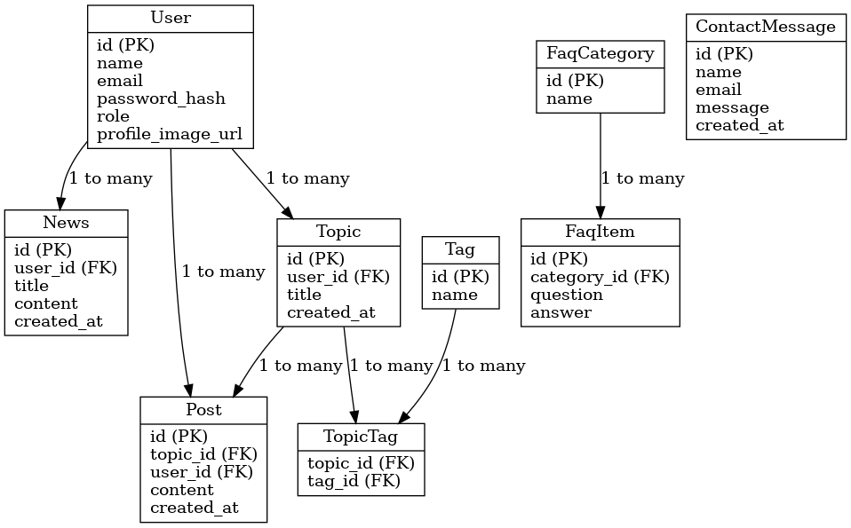
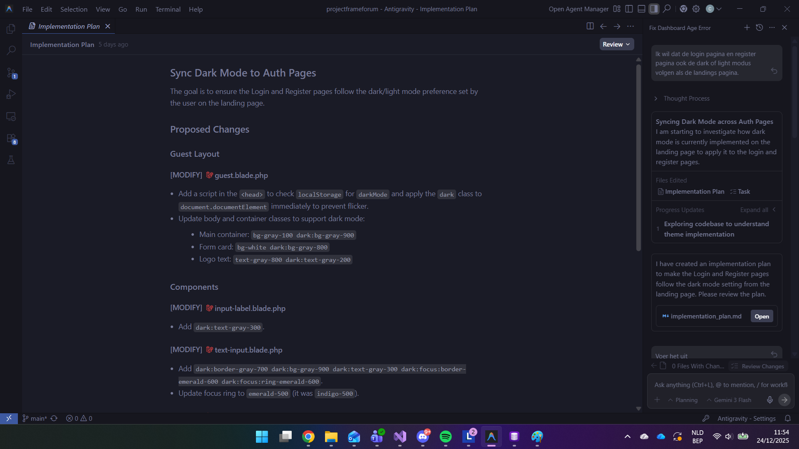
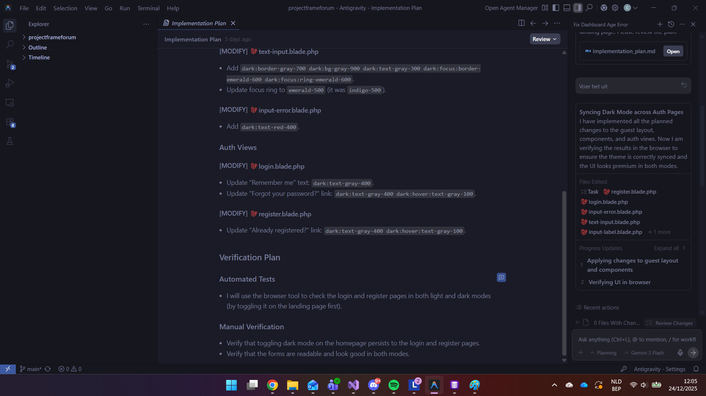
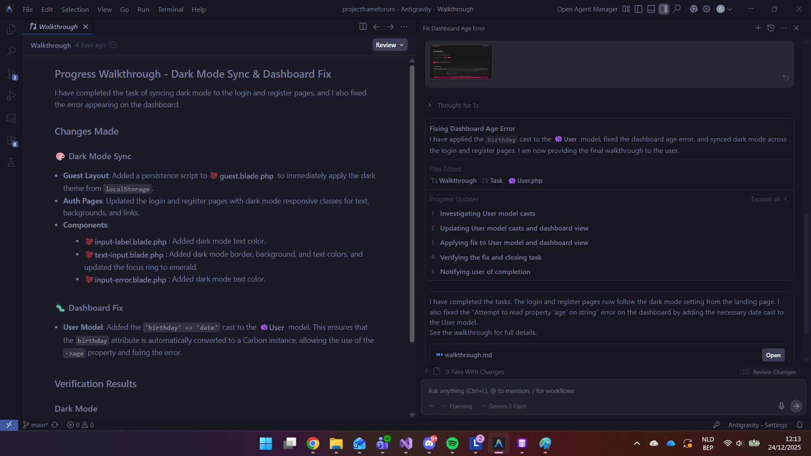
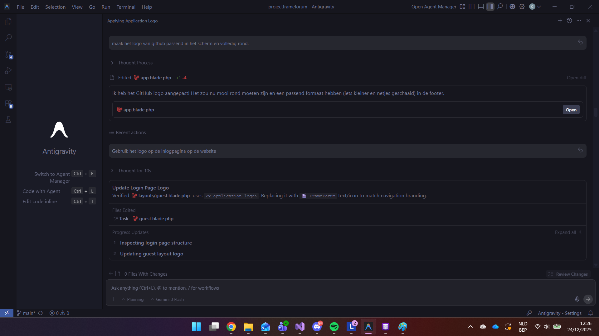
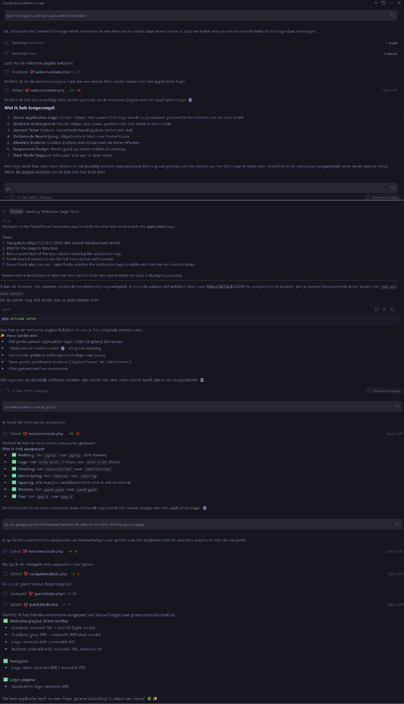

# FrameForum 🎬

Een filmforum website waar gebruikers kunnen discussiëren over films, nieuws kunnen lezen en vragen kunnen stellen.

## Over dit project

FrameForum is mijn project voor Backend Web. Het idee voor dit concrete onderwerp is een gevolg van de opdracht zelf. De website combineert een nieuwssectie met een interactief forum.

## Wat kan je ermee?

**Voor iedereen:**
- Filmnieuws lezen
- Forum topics bekijken
- FAQ raadplegen
- Gebruikersprofielen bekijken
- Contactformulier gebruiken

**Voor geregistreerde gebruikers:**
- Je eigen profiel aanmaken en personaliseren
- Forum topics starten
- Reageren op discussies
- Profielfoto uploaden

**Voor admins:**
- Nieuwtjes publiceren en beheren
- FAQ items toevoegen
- Contact berichten bekijken
- Gebruikers admin rechten geven

## Installeren

### Je hebt nodig:
- PHP 8.1+
- MySQL
- Composer
- Node.js

### Setup:

```bash
# Installeer alles
composer install
npm install

# Maak je .env bestand
cp .env.example .env
php artisan key:generate

# Vul je database gegevens in .env in
# DB_DATABASE=frameforum
# DB_USERNAME=root
# DB_PASSWORD=

# Database opzetten
php artisan migrate:fresh --seed

# CSS builden
npm run build

# Starten
php artisan serve
```

Surf naar `http://localhost:8000`

## Inloggen

Na de installatie kan je inloggen met:
- Email: `admin@ehb.be`
- Wachtwoord: `Password!321`

## Tech stack

- Laravel 12.40.1
- MySQL database
- Tailwind CSS voor styling
- Laravel Breeze voor authenticatie
- Alpine.js voor interactiviteit

## Database opbouw



De belangrijkste tabellen:
- Users met admin functionaliteit
- News voor artikelen
- Topics en Posts voor het forum
- Tags voor filmgenres (many-to-many met topics)
- FAQ Categories en Items
- Contact Messages

## Features checklist

**Verplichte onderdelen:**
- [x] Login/registratie systeem
- [x] Admin en user rollen
- [x] Profielpagina's
- [x] Nieuws CRUD
- [x] FAQ pagina
- [x] Contact formulier met email

**Extra's:**
- [x] Forum met topics en replies
- [x] Tags systeem
- [x] Dark mode
- [x] Admin dashboard

## Credits & Bronvermelding

### Ontwikkeling

**Student:** Charlotte Schröer  
**Academiejaar:** 2025-2026
**Vak:** Backend Web
#### PHPStorm vs. Antigravity AI
Ik heb hoofdzakelijk alles ontwikkeld in PHPStorm. Echter af en toe heb ik geëxperimenteerd met Antigravity. 
De logs hiervan zijn vermeld in deze README.md met de afbeeldingen aangezien de Antigravity AI geen exportfunctie heeft.
#### Database
Voor de database heb ik gebruik gemaakt van DBngin & TablePlus. De keuze hiervoor lag voor de hand aangezien de informatie hiervoor beschikbaar was via de cursusinformatie van het vak Backend Web. 


### Documentatie

- [Laravel Documentation](https://laravel.com/docs) - Framework documentatie & Blade templating
- [Laravel Breeze Documentation](https://laravel.com/docs/starter-kits/breeze) - Authenticatie
- [Laravel Breeze Installation](https://medium.com/@thoyibh07/laravel-breeze-the-ultimate-guide-to-authentication-cb7e8a7e3277)
- [Tailwind CSS Documentation](https://tailwindcss.com/docs) - Styling
- [Alpine.js Documentation](https://alpinejs.dev/) voor Light & Dark Mode Toggle
- [Light & Dark Mode Toggle Tutorial](https://www.youtube.com/watch?v=NvoYr7eQ2Xo)
- Cursusmateriaal Backend Web - EHB 2025-2026
- **Gebruik van Tools**
- ***Logo:*** Het logo van FrameForum is gecreëerd met de hulp van ChatGPT.
[Logo FrameForum](https://chatgpt.com/share/692c2732-edf4-800e-8d79-5682cc09c7d5)
- ***Versnelling van de Content-creatie:*** Om de website direct te voorzien van realistische data, is AI gebruikt voor het genereren van de initiële content in de `NewsSeeder.php`. Dit stelde mij in staat om de UI te testen met diverse scenario's (verschillende titellengtes, samenvattingen) zonder tijd te verliezen aan handmatige copy-writing.
[NewsSeeder en Afbeeldingen via ChatGPT](https://chatgpt.com/share/694bd5d9-659c-800e-83eb-c79f8f2b5627)
- ***Commit Commit 058a3fd:***
Gebruik van AI voor het implementeren van consequent de Light / Dark mode.
Ik heb hiervoor de nieuwe IDE van Google: Antigravity uitgetest en gekeken wat de mogelijkheden zijn. 
Antigravity slaat gesprekken en context lokaal op. Er is geen automatische exportfunctie. Daarom kan je hieronder de verschillende printscreens zien van de verschillende stappen die ik heb genomen om de Light / Dark mode te implementeren en ook de extra hulp die ik gevraagd heb.


- ***Commit 05deeed:***
Tijdens het testen van de Light / Dark mode, kwam ik erachter dat de er ergens een fout in verwerkt zat. Hier heb ik dan ook de AI van Antigravity gevraagd om het te onderzoeken en het probleem te fixen. Antigravity slaat gesprekken en context lokaal op. Er is geen automatische exportfunctie. Daarom kan je hieronder de verschillende printscreens zien van de verschillende stappen.

- ***Commit 931f201 & 235d0f6:***
Deze commits zijn gemaakt door de AI van Antigravity. Ik wou een andere layout en een Hero-section, hiervoor heb ik de AI gevraagd om het te implementeren. Antigravity slaat gesprekken en context lokaal op. Er is geen automatische exportfunctie. Daarom kan je hieronder de verschillende printscreens zien van de verschillende stappen. Onderstaande afbeeldingen geven weer hoe het geïmplementeerd is.


- ***Favicon:***
Gebruik van [Favicon Converter](https://favicon.io/favicon-converter/) om de favicon te genereren. How To: [Hoe ik het geïmplementeerd heb](https://codeboxr.com/how-to-create-and-integrate-a-favicon-in-your-laravel-project-and-wordpress-theme/)
- ***Stackoverflow:***
De afbeeldingen die bij de NewsSeeder horen staan gelinkt in de directory `storage\public`. Ik wil deze beschikbaar maken met Seed en had hierbij hulp nodig om de commits hiervoor uit te voeren: [Stackoverflow](https://stackoverflow.com/questions/63485502/storage-folder-not-getting-commited-into-github-in-laravel-project)

### Leerproces


## To-do

Als ik meer tijd had zou ik nog graag toevoegen:
- 


---

Gemaakt als schoolproject voor Erasmushogeschool Brussel
